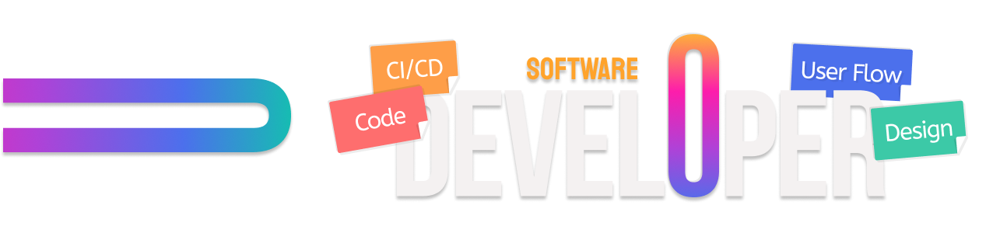

  Design background. Engineering mindset. Building scalable things with care.

 

# Hi, my name is Grasiela!

I'm a software developer with a background in design and strong experience in front-end development. Over the past few years, I’ve been transitioning into full-stack engineering — focusing on building robust, scalable systems with clean, thoughtful code.

Currently:

- 🌎 Working remotely for a US-based real estate startup
- 🎓 Enrolled in a full-stack post-grad program (2025–2026)
- 👩‍💻 Building projects with TypeScript and data structures
- 🧠 Exploring system design, low-level optimization and AI tools

## Techs

 
       

 
